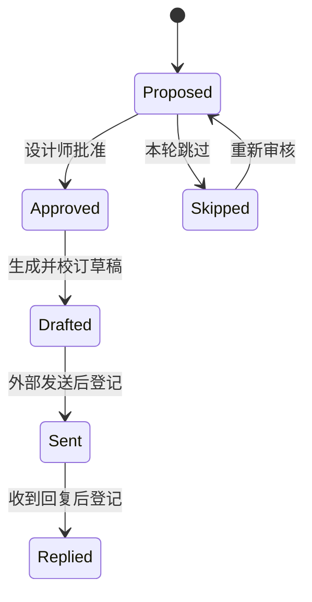

# Phase 17 — Campaign & Outreach Desk

Campaign & Outreach Desk 将系列发布、媒体资料、Private Showroom 与 Relationship & Opportunity 中已经确认的专业关系，编排为可审阅、可追踪、可交接的外联活动。它是设计师主导的策划与留痕工具，不是邮件营销平台：系统不会自动选择对象、发送消息、群发邀请或插入私享访问凭证。

## 产品目标

- 让每次系列发布、媒体预览、编辑沟通、买手跟进或合作提案拥有明确目标、市场、信息和时间窗口。
- 将“联系人可以被主动联系”与“这次活动应该联系他 / 她”拆成两次独立判断。
- 让统一活动叙事与每位对象的个性化角度并存，并在发送前保留人工校订。
- 只记录已经在外部渠道实际发生的发送与回复，避免把草稿或计划误报为触达。
- 将活动策略、审核记录、草稿和事实时间线纳入导出、快照与后续源码迁移。

## 人工审批链

`blocked` 是联系边界检查失败后的独立状态。联系人恢复为活跃、补充有效渠道并确认业务联系边界后，设计师才能重新检查并批准。

## 联系边界

每次读取工作台时都会使用联系人主档重新计算有效资格，而不是只相信活动对象创建时的快照：

| 资格 | 规则 | 行为 |
| --- | --- | --- |
| `eligible` | 联系人活跃；边界为业务往来或明确同意；存在可用渠道 | 可进入人工批准 |
| `missing_channel` | 偏好渠道为 none，或没有可用联系方式 | 加入后阻断 |
| `consent_unknown` | 联系边界仍为 unknown | 加入后阻断 |
| `do_not_contact` | 明确标记请勿主动联系 | API 拒绝加入活动 |
| `inactive` | 联系人暂停或归档 | 加入后阻断 |

系统不会抓取私人联系方式，也不会把媒体影响力、机构级别或社交数据转化为隐藏人物评分。

## 数据模型

### `outreach_campaigns`

活动主档保存：

- 稳定活动编号、名称、目标、状态与语言。
- 可选的系列、Publication 与 Private Showroom 外键。
- 市场、受众说明、统一主题、核心信息与行动请求。
- 保密截止、外联开始和结束时间。
- 内部备注、创建人及创建 / 更新时间。

新活动只能从 `draft` 或 `review` 开始。进入 `ready` 或 `active` 前必须具备主题、核心信息、行动请求、至少一个内容资产、至少一个可联系对象，并完成待审对象的人工判断。

### `outreach_recipients`

每个对象通过 `campaign_id` 与 `contact_id` 形成唯一审核席位，并可关联该联系人的一条机会。记录包括：

- 当前审批状态与创建时的联系资格快照。
- 针对该对象的沟通角度与人工审核说明。
- 草稿主题、正文、批准时间、外部发送登记时间与回复登记时间。
- 创建人及创建 / 更新时间。

外联活动不会复制联系人主档；资格始终由当前联系人状态、联系边界和渠道事实重新计算。

## 草稿与私享展厅

事实草稿由活动主档、联系人、系列名称、Publication 标题、Private Showroom 标题和人工沟通角度确定性生成：

- 不调用外部生成式 API。
- 不扩写未经记录的关系历史、媒体兴趣或合作承诺。
- 双语活动会生成中英文两个区块。
- 草稿可在 Studio 内人工校订并保存。
- Private Showroom 只以标题出现，并提示设计师手动加入链接。
- API 概览只返回展厅的安全摘要，不返回 `accessTokenHash`、访问凭证或完整私享 URL。

复制草稿是浏览器本地操作。发送必须在邮件、即时消息或其他外部专业渠道中由设计师完成。

## 事实登记与关系时间线

“登记已外部发送”要求对象已经人工批准或完成草稿，并在界面再次确认事实已经发生。登记后：

1. 对象保存 `sent_at`。
2. 创建一条已完成的 outbound Relationship Activity。
3. 更新联系人的 `last_contact_at`。

“登记收到回复”只适用于已经登记发送的对象，并以 inbound Relationship Activity 同步到关系时间线。两个动作都只写入事实记录，不会触发外部通信。

## API 与导出

- `GET /api/studio/outreach`：完整活动、对象、联系人资格与即时指标。
- `GET /api/studio/outreach?format=campaigns`：活动 UTF-8 CSV。
- `GET /api/studio/outreach?format=recipients`：对象、草稿与审核 UTF-8 CSV。
- `GET /api/studio/outreach?format=json`：工作台 JSON。
- `POST /api/studio/outreach`：建立草稿 / 审核活动。
- `PATCH /api/studio/outreach/:id`：更新活动策略、状态和时间窗口。
- `POST /api/studio/outreach/recipients`：将联系人加入活动审核。
- `PATCH /api/studio/outreach/recipients/:id`：批准、生成 / 校订草稿、跳过、登记发送或回复。

所有路由都要求设计师管理员身份，读取响应禁止缓存，写操作拒绝跨站请求。

## 归档与迁移

Archive 格式升级为 `nera-archive/9`，新增：

- `datasets.outreachCampaigns`
- `datasets.outreachRecipients`
- 两类数据的 inventory、不可变快照计数与版本差异。

迁移时应依次导入联系人、机会、活动主档和活动对象，并保持稳定 ID、资格快照、批准 / 发送 / 回复时间和创建人。源码包含 Drizzle schema 与 `0014_useful_luckman.sql`。

当前部署继续使用 OpenAI Sites 承载应用，Cloudflare Workers 运行服务端逻辑，D1 保存结构化数据，R2 保存媒体。迁往 Vercel 时 React 界面、审批规则、API 语义和数据模型可以继续使用，但需要把 D1 / R2 运行时适配到目标数据库与对象存储。
